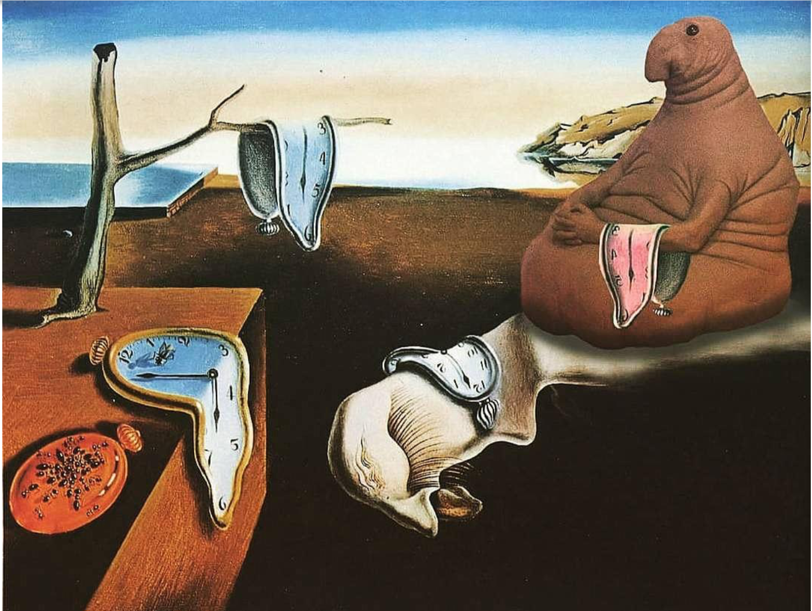
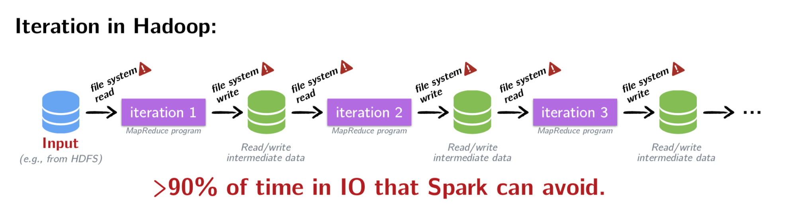
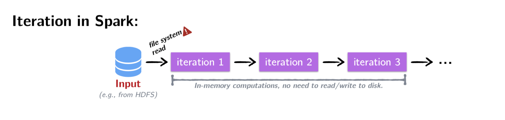
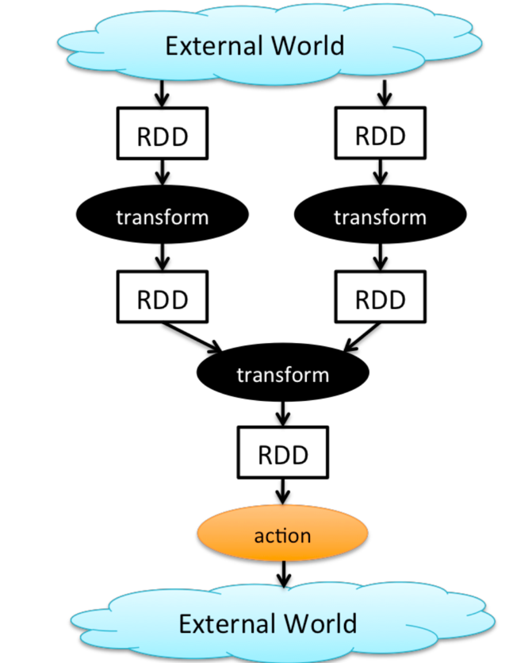

### Spark introduction

---
### Hadoop/MapReduce

Hadoop is widely used large-scale batch data processing framework  
It was great because of:
* simple API
* fault tolerance
---
@snap[north]
#### and it was like
@snapped
&size=90% auto
---
### and now Spark is here
@ul
* fault tolerant
* functional style api
* different strategy for handling latency 
@ulend
--- 
Data is immutable and stored in-memory     
Operations are functional transformations       
Fault tolerance is achieved by replaying transformations starting from original dataset     
  
As result Spark can be 100x (watch the numbers) faster then Hadoop      
---
### iterations in Hadoop/MapReduce vs Spark



---
### some cool things about Spark: 
@ul
* native Scala, Java, Python, R interface   
* interactive shell (repl)    
* efficient distributed operations   
* reusing existing Hadoop ecosystem  
* opensource 
@ulend

---?image=images/spark-stack.png&size=53%
@snap[north]
#### Spark nowadays
@snapped
---?image=images/spark-distributed-mode.png&size=50%
@snap[north]
### Spark distributed mode
@snapped
---
@ul
* Master-slave architecture   
* Driver is the process where the main method runs  
* Executors are responsible for running the individual tasks in given Spark job
* Driver + executor == spark app 
@ulend
---
### There are 3 collection types:
@snap[east]
@ul 
* RDD
* DataFrame
* Dataset 
@ulend
@snapped
@snap[west]
and they are
@ul
* resilient
* distributed
* immutable
* in-memory
* lazy
* parallel-partitioned 
@ulend
@snapped
--- 
### Resilient Distributed Dataset 
@snap[east]
&size=80%
@snapped
@snap[wesr]
Seems like immutable sequential or parallel Scala collection.
@snapped
---
### first peace of rdd
adsad
---
### RDD operations
There are two main types:
* transformations
returns new collection as a result
```scala
map([B]f: A => B): RDD[B]
```
* actions
```scala
reduce(op: (A, A) => A): A
```
---
### world count 
```scala
val text = spark.textFile("hdfs://path/to/file.txt")
val count = rdd.flatMap(line => line.split(" "))
                    .map(word => (word, 1))
                    .reduceByKey(_ + _)
```
---
### Dataframes
---
### Datasets