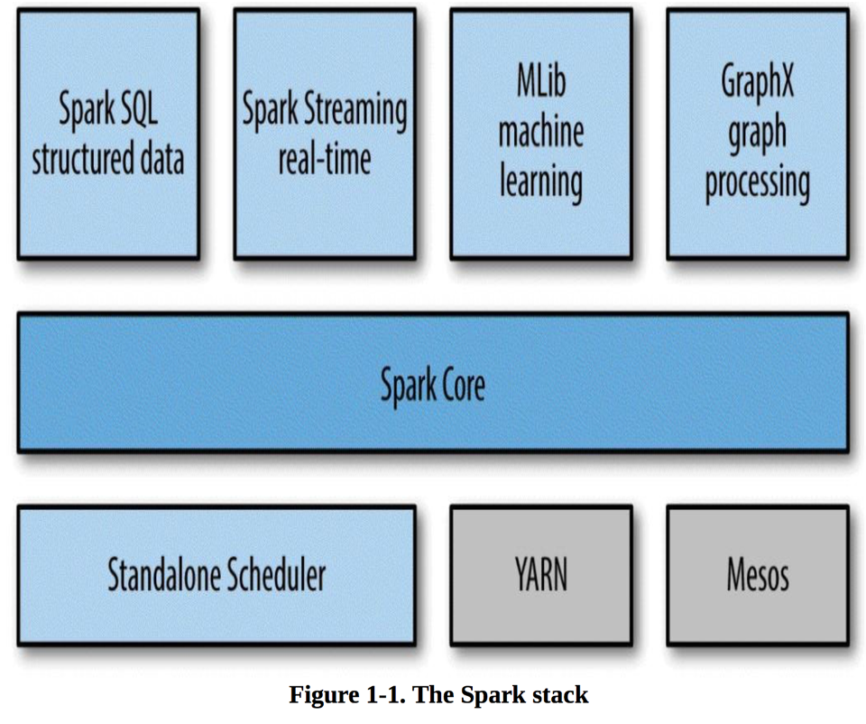
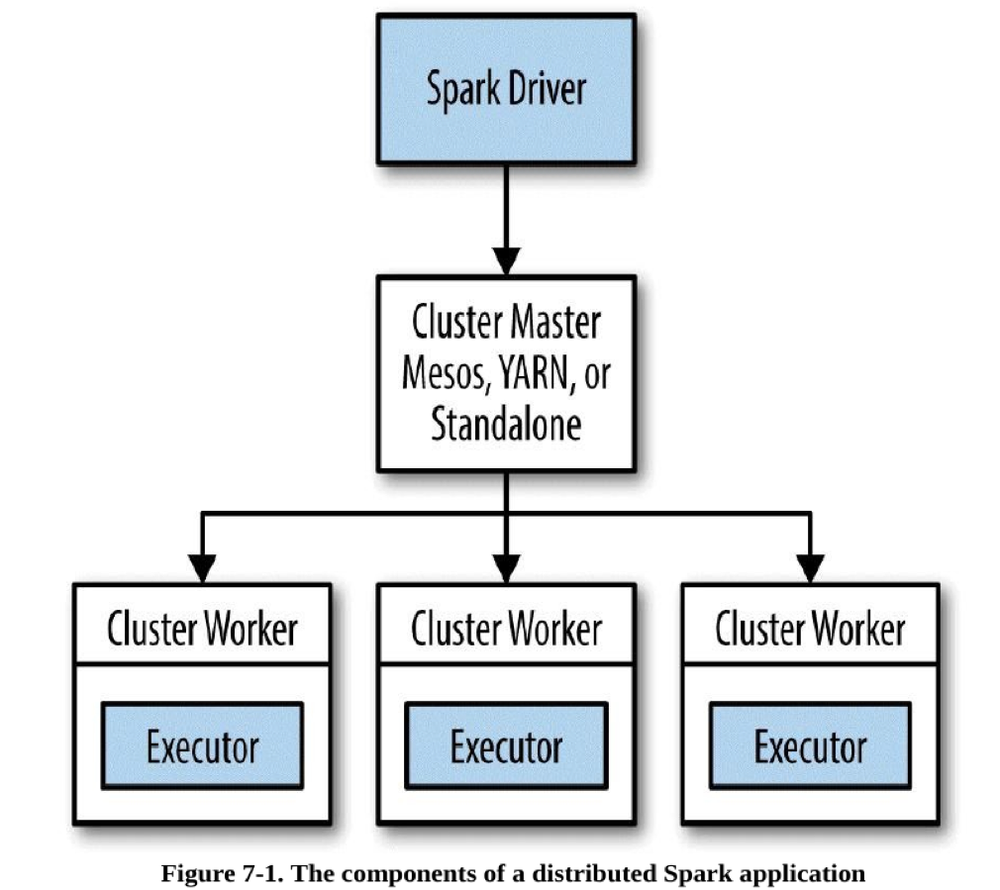

### Spark introduction

---
### Hadoop/MapReduce

Hadoop is widely used large-scale batch data processing framework  
@snap[west]
It was great because of:
@snapped
* simple API
* fault tolerance

*** Because of these Hadoop became framework for large files. 
It is possible to deploy Hadoop with 1k nodes ***
---
@snap[north]
#### and it was like
@snapped
&size=90% auto
---
### and now Spark is here
It is:
* fault tolerant
* functional style api
* different strategy for handling latency

all data is immutable and in-memory     
operations are functional transformations     
fault tolerance is achieved by replaying transformations starting from original dataset   
  
As result Spark can be 100x (watch the numbers) faster then Hadoop      
--- 
### iterations in Hadoop/MapReduce vs Spark


---
### some cool things about Spark: 
* native Scala, Java, Python, R interface   
* interactive shell (repl)    
* efficient distributed operations   
* reusing existing Hadoop ecosystem  
* opensource

--- 
### Spark nowadays


--- 
### Spark distributed mode
@snap[west]

@snapped

@snap[east]
* master-slave architecture   
* driver is the process where the main method runs  
* executors are responsible for running the individual tasks in given Spark job
* driver + executor == spark app
@snapped
---
### There are 3 collection types:
@Snap[east]
* Resilient Distributed Datasets
* DataFrame
* Dataset
@snapped
@snap[west]
* resilient
* distributed
* immutable
* in-memory
* lazy
* parallel-partitioned
@snapped
--- 
### Resilient Distributed Dataset 
@snap[east]

@snapped
@snap[wesr]
Seems like immutable sequential or parallel Scala collection.
@snapped
---
### first peace of rdd
adsad
---
### RDD operations
There are two main types:
* transformations
returns new collection as a result
```scala
map([B]f: A => B): RDD[B]
```
* actions
```scala
reduce(op: (A, A) => A): A
```
---
### world count 
```scala
val text = spark.textFile("hdfs://path/to/file.txt")
val count = rdd.flatMap(line => line.split(" "))
                    .map(word => (word, 1))
                    .reduceByKey(_ + _)
```
---
### Dataframes
---
### Datasets