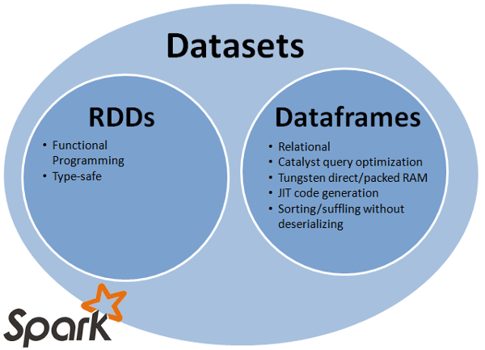

### Spark introduction

---
<h3> Hadoop/MapReduce </h3>

Hadoop is widely used large-scale batch data processing framework  
It was great because of:
* simple API
* fault tolerance
---
@snap[north]
<h3> and it was like </h3>
@snapend

&size=60%
---
<h3> and now Spark is here </h3>
@ul
* fault tolerant
* functional style api
* different strategy for handling latency 
@ulend
--- 
Data is immutable and stored in-memory     
Operations are functional transformations       
Fault tolerance is achieved by replaying transformations starting from original dataset     
  
As result Spark can be 100x (watch the numbers) faster then Hadoop      
---
<h3> iterations in Hadoop/MapReduce vs Spark </h3>


---
<h3> some cool things about Spark: </h3>
@ul
* native Scala, Java, Python, R interface   
* interactive shell (repl)    
* efficient distributed operations   
* reusing existing Hadoop ecosystem  
* opensource 
@ulend

---?image=images/spark-stack.png&size=53%

@snap[north]

<h3> Spark nowadays </h3>

@snapend

---?image=images/spark-distributed-mode.png&size=50%

@snap[north]
<h3> Spark distributed mode </h3>
@snapend

---
@ul
* Master-slave architecture   
* Driver is the process where the main method runs  
* Executors are responsible for running the individual tasks in given Spark job
* Driver + executor == spark app 
@ulend

---
<h3> Main APIs: </h3>



* RDD
* DataFrame
* Dataset 

@snap[east]
and they are
@ul
* resilient
* distributed
* immutable
* in-memory
* lazy
* parallel-partitioned 
@ulend
@snapend
--- 
### Resilient Distributed Dataset 
@snap[east]
&size=80%
@snapend
@snap[west]
Seems like immutable sequential or parallel Scala collection.
@snapend
---
### first peace of rdd
adsad
---
### RDD operations
There are two main types:
* transformations
returns new collection as a result
```scala
map([B]f: A => B): RDD[B]
```
* actions
```scala
reduce(op: (A, A) => A): A
```
---
### world count 
```scala
val text = spark.textFile("hdfs://path/to/file.txt")
val count = rdd.flatMap(line => line.split(" "))
                    .map(word => (word, 1))
                    .reduceByKey(_ + _)
```
---
### Dataframes
---
### Datasets