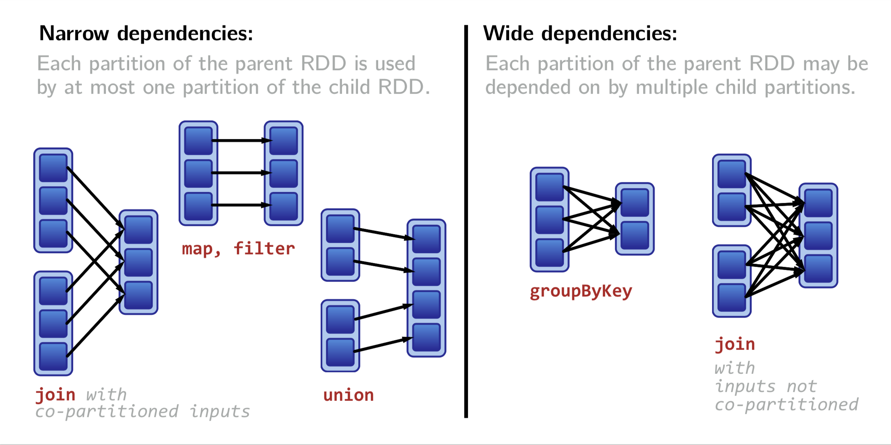

### Spark introduction

---
<h3> Hadoop/MapReduce </h3>

Hadoop is widely used large-scale batch data processing framework  
It was great because of:
* simple API
* fault tolerance
---
<h3> and it was like </h3>
&size=60% auto
---
<h3> and now Spark is here </h3>
@ul
* fault tolerant
* functional style api
* different strategy for handling latency 
@ulend
---
<h3> iterations in Hadoop/MapReduce vs Spark </h3>


--- 
**Data** is immutable and stored in-memory     
**Operations** are functional transformations       
**Fault tolerance** is achieved by replaying transformations starting from original dataset     
  
As result Spark can be 100x (watch the numbers) faster then Hadoop      
---
<h3> some cool things about Spark: </h3>
@ul
* native Scala, Java, Python, R interface   
* interactive shell (repl)    
* efficient distributed operations   
* reusing existing Hadoop ecosystem  
* opensource 
@ulend

---?image=images/spark-stack.png&size=53%

@snap[north]

<h3> Spark nowadays </h3>

@snapend

---?image=images/spark-distributed-mode.png&size=50%

@snap[north]
<h3> Spark distributed mode </h3>
@snapend

---
@ul
* Master-slave architecture   
* Driver is the process where the main method runs  
* Executors are responsible for running the individual tasks in given Spark job
* Driver + executor == spark app 
@ulend

---
<h3> Main APIs: </h3>

---?image=images/rdd-flow.png&size=35%
@snap[north]
<h3> Resilient Distributed Dataset </h3>
@snapend
<!-- @snap[east] -->
<!-- &size=contain -->
<!-- @snapend -->
---
### RDD operations
There are two main types:
* **transformations**
returns new collection as a result
```scala
map([B]f: A => B): RDD[B]
```
* **actions**
```scala
reduce(op: (A, A) => A): A
```
---
<h4> Transformations <h4>
* `map`
* `filter`
* `groupByKey`
* `reduceByKey`
* `mapValues`
* `keys`
* `join`
* `leftOuterJoin/rightOuterJoin`
---
<h4> Narrow & Wide tranformations </h4>

---?image=images/narrow-wide-complex.png&size=60%
---
<h4> Actions <h4>
* `reduce`
* `collect`
* `count`
* `first`
* `take`
* `countByKey`
* `saveAsTextFile`
---
### world count 
```scala
val text = spark.textFile("hdfs://path/to/file.txt")
val count = rdd.flatMap(line => line.split(" "))
                    .map(word => (word, 1))
                    .reduceByKey(_ + _)
```
---
---
<h4> MapReduce Word count </h4>
```java
import java.io.IOException;
import java.util.StringTokenizer;

import org.apache.hadoop.conf.Configuration;
import org.apache.hadoop.fs.Path;
import org.apache.hadoop.io.IntWritable;
import org.apache.hadoop.io.Text;
import org.apache.hadoop.mapreduce.Job;
import org.apache.hadoop.mapreduce.Mapper;
import org.apache.hadoop.mapreduce.Reducer;
import org.apache.hadoop.mapreduce.lib.input.FileInputFormat;
import org.apache.hadoop.mapreduce.lib.output.FileOutputFormat;

public class WordCount {

  public static class TokenizerMapper
       extends Mapper<Object, Text, Text, IntWritable>{

    private final static IntWritable one = new IntWritable(1);
    private Text word = new Text();

    public void map(Object key, Text value, Context context
                    ) throws IOException, InterruptedException {
      StringTokenizer itr = new StringTokenizer(value.toString());
      while (itr.hasMoreTokens()) {
        word.set(itr.nextToken());
        context.write(word, one);
      }
    }
  }

  public static class IntSumReducer
       extends Reducer<Text,IntWritable,Text,IntWritable> {
    private IntWritable result = new IntWritable();

    public void reduce(Text key, Iterable<IntWritable> values,
                       Context context
                       ) throws IOException, InterruptedException {
      int sum = 0;
      for (IntWritable val : values) {
        sum += val.get();
      }
      result.set(sum);
      context.write(key, result);
    }
  }

  public static void main(String[] args) throws Exception {
    Configuration conf = new Configuration();
    Job job = Job.getInstance(conf, "word count");
    job.setJarByClass(WordCount.class);
    job.setMapperClass(TokenizerMapper.class);
    job.setCombinerClass(IntSumReducer.class);
    job.setReducerClass(IntSumReducer.class);
    job.setOutputKeyClass(Text.class);
    job.setOutputValueClass(IntWritable.class);
    FileInputFormat.addInputPath(job, new Path(args[0]));
    FileOutputFormat.setOutputPath(job, new Path(args[1]));
    System.exit(job.waitForCompletion(true) ? 0 : 1);
  }
}
```
---
### Dataframes
---
### Datasets